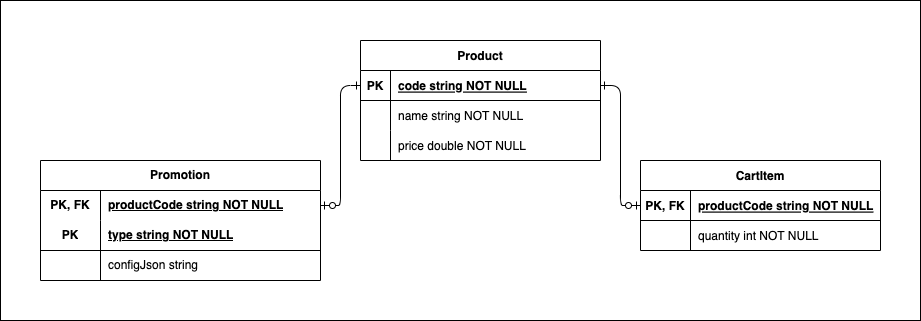

# Cabify Mobile Challenge

## Screenshots

- [Products Screen](assets/screenshot-products.png)
- [Product Detail Screen](assets/screenshot-product-detail.png)
- [Shopping Cart Screen](assets/screenshot-shopping-cart.png)
- [Promotions Applied Sheet](assets/screenshot-cart-promotions-applied.png)

## APK

- Download Debug APK: [app-debug.apk](assets/app-debug.apk)

## Environment

- IDE: Android Studio Flamingo | 2022.2.1 Patch 1
- OS: macOS Monterrey.

## Main Technologies

- RxJava3: Threading and reactive streams support.
- Dagger: Dependency injection.
- Room: Database ORM.
- UI Design System: Material 3.
- Gradle Version Catalog: Dependency management.

## Screens

Three main screens are available in the app (see screenshots above for reference):

1. **Products Screen**: Browse available products to purchase and see number of items currently in the shopping cart.
2. **Product Detail Screen**: Visualize the details for a given product, the user can also:
   - See if there's any promotion available
   - Add the underlying product to the shopping cart.
3. **Shopping Cart Screen**: View all products added to the cart for purchasing, the user can also:
   - Detailed description of promotions applied to each cart item (if any).
   - The total amount and discounted amount (if promotions were applied).
   - Edit items quantity or remove items from cart.

## Architecture

Presentation architecture for this assignment is Model-View-ViewModel (MVVM), in combination with recommended [Android Modern App Architecture](https://developer.android.com/topic/architecture#recommended-app-arch) for organizing the app modules.

**App Modules**
- `data`: Contains all business logic and UI-agnostic components, including storage layer, products, promotions and shopping cart management and calculations. the main components on this layer are:
  - Networking.
  - Database.
  - Repositories.
  - Data Model.
  - Promotion calculators.
  - Shopping cart price calculator.
- `app`: Contains UI-related components and presentation logic, such as navigation, formatting and image loading.
  - Activities
  - Fragments
  - ViewModels
  - Workers
  - UIModels and UIActions

## Storage

All information is the App is kept in a local SQLite database using Room as ORM. At a glance, the schema is the following:



- **Product**: represents a Product that the user can browse and add to the shopping cart.
- **Promotion**: represent a promotion that is available to a given product. A product can have at most one promotion available.
- **CartItem**: represents an item added by the user to the shopping cart. All entries in the CartItem table represent the full shopping cart.

## Sync from Server

Synchronization from server is implemented using the WorkManager framework.

For simplicity, the sync worker is triggered with a expedited approach only under the following scenarios:

- During App start-up (`Application.onCreate()`).
- On-Demand by the user upon SwipeToRefresh from the Products Screen.

## Promotion Calculation

### Loading Promotions

In a real Prod App, promotion information should ideally be dictated by the server. To simulate this behavior, I've made the promotions in this challenge to be loaded from a [FakePromotionsDataSource.kt](data/src/main/java/com/jesussoto/android/cabifyshop/data/api/FakePromotionsDataSource.kt) that always provides the same promotion information as JSON and which is always loaded as part of the [ShopSyncWork.kt](app/src/main/java/com/jesussoto/android/cabifyshop/sync/ShopSyncWork.kt). This is an example of the JSON:
```json
{
  "promotions": [
    {
      "productCode" : "VOUCHER",
      "type" : "BuyXGetXPromotion",
      "config": {
        "minApplicableQuantity": 2,
        "quantityToGetForFree": 1
      }
    },
    {
      "productCode" : "TSHIRT",
      "type" : "FixedBulkPricePromotion",
      "config": {
        "minApplicableQuantity": 3,
        "discountedUnitPrice": 19.0
      }
    }
  ]
}
```

Under this approach, the promotions in the App are **configurable** by the server, meaning that the App can interpret and process remote promotions information and apply calculations to the products in the Shopping Cart.

Two types of promotions are supported by this version of the App.

1. **"Buy X, Get X Free"**: Promotions of type 2-for-1, 3-for-2, etc, can be applied by using `BuyXGetXPromotion` type, it is just a matter of setting the appropriate promo configuration and specify which product it should be applied to, in this case it is configure to apply a 2-for-1 promotion on **VOUCHER**.
2. **"Fixed Bulk Price Discount"**: Promotions where a discounted unit price is available when purchasing as least X units of a given product can be applied by using `FixedBulkPricePromotion` type. In this example, it is configured to apply a reduced unit price of $19.0 when purchasing at least 3 **TSHIRT**.

### Applying Promotions

All promotions supported are **item-level promotions**, which means, promotions that are based and applied exclusively to a specific cart item without considering other factors.

In the current version there's **no support for cart-level promotions,** such as "free shipping when the total amount is greater than $100" or "-10% discount on the total price when purchasing more than 5 items".

The main components involved in promotion calculations are:

- `FixedBulkPricePromotionConfig`, `BuyXGetXPromotionConfig`: Simple POJOs to hold the config information for each promotion type.
- `FixedBulkPricePromotionCalculator`, `ButXGetXPromotionCalculator`: Implementations of [PromotionPriceCalculator.kt](data/src/main/java/com/jesussoto/android/cabifyshop/data/cart/PromotionPriceCalculator.kt) which hold the low-level arithmetic calculations to compute the discounted item price after applying the promotion.
- [CartItemPriceCalculator.kt](data/src/main/java/com/jesussoto/android/cabifyshop/data/cart/CartItemPriceCalculator.kt): Relies on the `PromotionPriceCalculator`s to verify whether a promotion is applicable to a given CartItem, and if so, saves the new item-level discounted price.
- [CartPriceCalculator.kt](data/src/main/java/com/jesussoto/android/cabifyshop/data/cart/CartPriceCalculator.kt): Iterates through all the items in the Shopping Cart and relies on `CartItemPriceCalculator` to apply promotions for each of them. Finally performs other cart-level operations such as calculate the total item quantity, total price and total savings amount.

### What would it take to change/add promotions.

#### To shift around *existing* promotions

If wish to modify `BuyXGetXPromotion` or `FixedBulkPricePromotion` applied to the different products, it all comes to modify the
[FAKE_PROMOTIONS_RESPONSE_JSON](data/src/main/java/com/jesussoto/android/cabifyshop/data/api/FakePromotionsDataSource.kt#L46) and to configure the reference the products which the promotions belong to.

#### To support *new* promotions

If wish to support promotions other than `BuyXGetXPromotion` or `FixedBulkPricePromotion`, then the following need to be performed:

- Extend [PromotionType](data/src/main/java/com/jesussoto/android/cabifyshop/data/model/Promotion.kt#L16) to add the new promotion
- Create `*PromotionConfig` if the new promotion is configurable from backend
- Create a new `PromotionPriceCalculator` to hold the arithmetic calculation of the discounted price and its applicability.
- Extend [PromotionPriceCalculatorProvider.kt](data/src/main/java/com/jesussoto/android/cabifyshop/data/cart/PromotionPriceCalculatorProvider.kt) to return the adequate `PromotionPriceCalculator` for the new promotion.

## Limitations and Assumptions

- Product to Promotion relationship is one-to-one, meaning a product can have **at most** one promotion available.
- Due to the above, a given cart item may have **at most** one promotion applied to it.
- All product codes in `FAKE_PROMOTIONS_RESPONSE_JSON` are valid and existent in Products.json
- All promotion “type” values in `FAKE_PROMOTIONS_RESPONSE_JSON` must be present in PromotionType to be properly parsed and applied.


## Left out for further improvement due to time constraints

- See my many TODOs and comments for some low-level improvements.
- Implement Domain Layer.
- Unit Testing, specially the promotion calculation engine and ViewModels.
- Espresso UI testing.
- Enhanced error handling, to separate errors from external sources (network) vs. internally thrown and communicate them back to the user.
- Extract currency formatting logic to the Data/Domain Layer to account for use cases where the backend specifies the currency to display.
- Use Jetpack's Navigation to navigate between screens.
- Use AssistedInjection to inject activity launching parameters into ViewModels.
- More detailed documentation comments.
- Better UI widget for product quantity selection.
- Configure ProGuard.

## Imagery

- Voucher: https://dribbble.com/shots/8226484-Voucher-with-2x-benfits
- T-Shirt: https://dribbble.com/shots/18819199-Summer-T-shirt
- Mug: https://dribbble.com/shots/17755721-Free-Hand-Holding-Psd-Mug-Mockup
